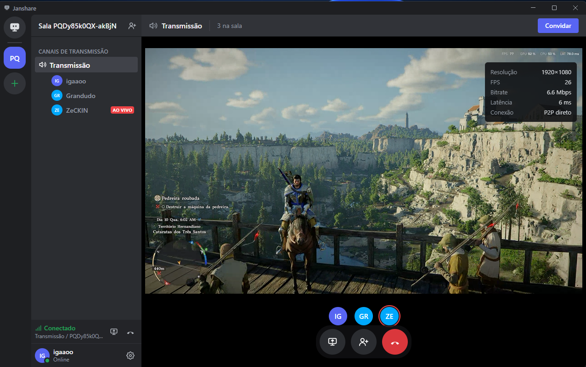

<div align="center">


# Janshare - lightweight peer-to-peer screen sharing

**Create a room, send the link, go live.**<br>
Video travels straight from one computer to another. No sign-up, no media servers, no cost.

[**Download for Windows**](https://github.com/igaaoo/Janshare/releases/latest) · [How it works](#how-it-works) · [Security & privacy](#security--privacy) · [Development](#development)

English · [Português](README.pt-BR.md)

</div>

<br>



## Features

**Streaming**

- **Share a window or your whole screen**, with live thumbnails in the picker.
- **Adjustable quality:** 720p, 1080p or native resolution, at 15, 30 or 60 FPS. The app estimates the upload you need before you go live.
- **Computer audio without echo:** system audio is streamed **without Discord's sound**, so people already on a voice call don't hear voices twice (native Windows capture, falling back to full system audio when that isn't possible).
- **Switch sources without dropping anyone:** change window, quality or toggle audio mid-stream.
- **Global shortcut** `Ctrl+Shift+S` to start or stop streaming from anywhere.

**Watching**

- **Player with fullscreen, volume and "keep on top"**, so you can watch while using another app.
- **Live stats:** resolution, FPS, bitrate, latency and connection type (direct P2P or relay).
- **Automatic reconnection:** if the connection drops, the app reconnects and resumes the same stream on its own.

**Rooms**

- **Up to 8 people per room:** 1 streaming and up to 7 watching.
- **Invite by link:** recipients click it and the app opens straight into the room (`janshare://`). Pasting the link or room code also works.
- **Recent rooms** in the sidebar and a **profile with name and color**, stored only on your computer.
- **Notifications** when someone joins, leaves or starts streaming.

**App**

- **English and Portuguese**, following your system language, switchable in Settings.
- **Automatic updates:** new versions download in the background and install with one click (never in the middle of a stream).
- **No account, no login:** open it, pick a name, you're ready.

## Getting started

1. Download the installer from [Releases](https://github.com/igaaoo/Janshare/releases/latest) and run it.
   > The installer isn't code-signed yet, so Windows SmartScreen may warn you the first time: click **More info → Run anyway**.
2. Pick your name and color.
3. Click **+** to **create a room**: the invite link is copied automatically.
4. Send the link. Whoever clicks it joins the room directly.
5. Click **Share screen**, choose the window, quality and audio, then **Go live**.
6. Everyone else clicks **Watch stream**.

## How it works

```
                 ┌──────────── Cloudflare ─────────────┐
                 │  Worker + one Durable Object/room   │
                 │  (only introduces the peers)        │
                 └────────▲─────────────────▲──────────┘
                 signaling │ (WebSocket)     │
                           │                 │
          ┌────────────────┴──┐         ┌────┴──────────────────┐
          │ Streamer          │═════════│ Viewers (up to 7)     │
          │ Electron + React  │  video  │ Electron + React      │
          └───────────────────┘   P2P   └───────────────────────┘
                              (WebRTC, straight between PCs)
```

- **The server only handles signaling.** A Cloudflare Worker with one Durable Object per room relays the messages computers need to find each other. From then on, **video and audio flow directly between PCs** over WebRTC and never touch the server.
- **Rooms hibernate:** with the WebSocket Hibernation API, an idle room costs nothing. That's what keeps the project at **zero cost** on Cloudflare's free tier.
- **Mesh topology:** the streamer sends one copy to each viewer, hence the 8-person cap: the streamer's upload is the resource that scales.
- **Source switching without renegotiation:** video and audio transceivers are fixed and sources are swapped with `replaceTrack`; quality is tuned with `setParameters`.

**Stack:** Electron, React and TypeScript (electron-vite) for the app; Cloudflare Workers and Durable Objects for the server; a native C++ helper (WASAPI _process loopback_) for audio.

**The name:** _Jan_ comes from _janela_, Portuguese for "window", which is exactly what you share.

## Security & privacy

**What's protected**

- **End-to-end encrypted media:** WebRTC uses DTLS-SRTP. Neither the server nor your ISP can see the video.
- **Nothing is stored:** the server keeps no video, audio, messages or history. Your profile and recent rooms live only on your computer.
- **Invite-only rooms:** there's no search and no public room list. Codes generated by the app carry 96 random bits and can't be guessed.
- **Camera and microphone always blocked:** the app can only capture the screen you choose. No page can turn on your camera or microphone.
- **You decide what goes live:** nothing is streamed until you pick a source in the picker. Links and shortcuts never start a stream on their own.

**How the app defends itself**

- **Isolated UI:** Chromium sandbox, `contextIsolation` and no Node.js access in the interface; the bridge to the system exposes only specific actions. The app never navigates away or opens windows.
- **Messages validated on both ends:** the server relays only known, well-formed fields, and the app validates them again before use.
- **Abuse limits:** per-connection message rate limits and a capped queue of connection candidates, so no one can freeze someone else's app.
- **No identity spoofing:** the server sets the sender of every message, and automatic reconnection recognizes the streamer by a key derived from a session secret, not by name (which anyone could copy). Names are stripped of invisible characters.

**What you should know**

- **People in your room see your public IP** once the video connection is established. That's how P2P works. Only share rooms with people you know.
- **Anyone with the link can join.** The app tells you when someone starts watching.
- **System audio includes everything playing on your PC**, except Discord. Close what you don't want to stream.
- **Anonymous usage statistics** (install, session and stream counts) are sent without names, IPs or content; the install identifier is random and stored only as a hash.

## Responsible use

Janshare is intended for **adults (18+)** sharing their screen with people they know. Using it to stream illegal content or to contact minors is prohibited. To report abuse, open an [issue](https://github.com/igaaoo/Janshare/issues).

## Development

Requirements: Node.js 20+ and Windows 10 (version 2004) or later. Visual Studio with C++ is only needed to rebuild the audio helper.

**Server** (repository root)

```bash
npm install
npm run dev       # local Worker at http://127.0.0.1:8787
npm run deploy    # publish to Cloudflare (npx wrangler login the first time)
```

**Desktop app**

```bash
cd desktop
npm install
npm run dev        # app with hot reload
npm run typecheck
npm run dist       # builds desktop/release/Janshare-Setup-x.y.z.exe
npm run native     # rebuilds the audio helper (optional)
```

To test the app against the local server, set the server to `http://127.0.0.1:8787` in **Settings**.

**Translations:** every UI string lives in `desktop/src/renderer/src/lib/i18n.tsx` (English and Portuguese dictionaries); add new keys to both.

**TURN (optional):** for networks where direct connections fail, configure Cloudflare Realtime TURN. Without it the app uses STUN only, and video never goes through the server.

```bash
npx wrangler secret put TURN_KEY_ID
npx wrangler secret put TURN_KEY_API_TOKEN
```

**Publishing a release**

1. Bump `version` in `desktop/package.json`.
2. Create `desktop/electron-builder.env` with `GH_TOKEN=...`: a GitHub token with **Contents: Read and write** on this repository. The file is git-ignored.
3. Run `npm run release` in `desktop/`. The script publishes the installer to Releases, and installed apps update themselves.

## Limitations

- Windows only (10 version 2004 or later for audio without Discord).
- Unsigned installer: SmartScreen warning on first run.
- Without TURN, some very restrictive networks (some mobile carriers and CGNAT) can't establish a direct connection.
- P2P mesh: with many viewers at high quality, the streamer's upload is the limit.
